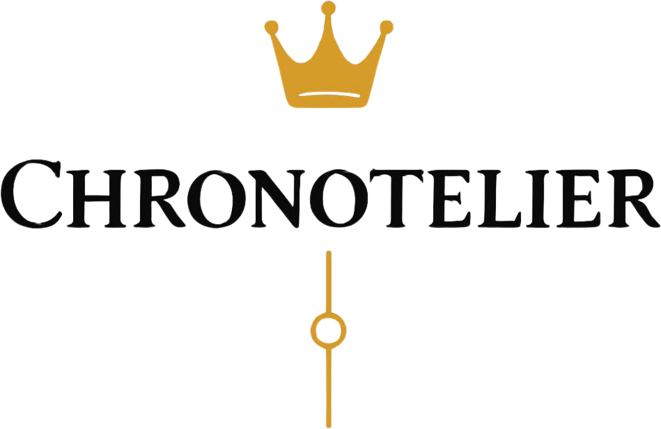
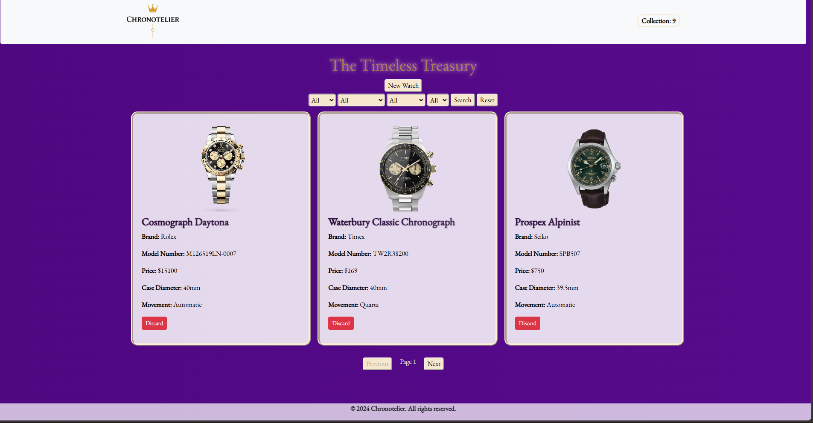

  

A clean, responsive dashboard designed for horology enthusiasts to catalog, curate, and manage their personal watch collection in one place.

---

## Preview

---

## Key Features

* **Visual Collection Grid:** Showcase timepieces with image previews, reference numbers, brand, and specifications.
* **Add New Watches:** Simple interface to register new additions with custom specs and photos.
* **Delete / Archive:** Remove pieces that have left your collection.
* **Responsive Layout:** Optimized viewports across desktop monitors, tablets, and mobile devices.

---

## Tech Stack

* **Frontend/Backend:** React.js
* **Styling:** CSS
